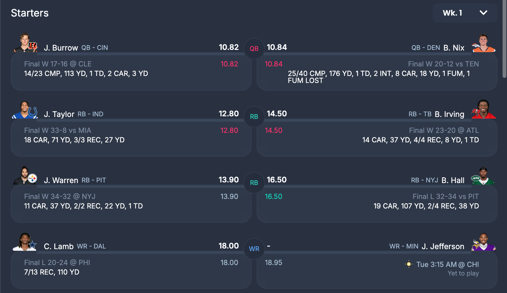

# Sleeper.com weekly matchup extractor bookmarklet

_First season playing Fantasy Football through Sleeper.com and I wanted a way to store weekly matchups in my notes so I built this bookmarklet that turns the weekly matchup view into a markdown table._

Create a Markdown table from https://sleeper.com/leagues/[league-id]/matchup page for the week.

## How to use

Copy the code from [toMarkdown-bookmarklet.js](toMarkdown-bookmarklet.js) into the URL field of a new bookmark.

Click the bookmarklet when on Sleeper.com weekly matchup view to copy a Markdown table to clipboard.

Format:

Me|Score|-|Score|Opponent
----|----|----|---|----
J. Burrow (QB, CIN)|10.82|-|10.84|B. Nix (QB, DEN)
J. Taylor (RB, IND)|12.80|-|14.50|B. Irving (RB, TB)
J. Warren (RB, PIT)|13.90|-|16.50|B. Hall (RB, NYJ)
C. Lamb (WR, DAL)|18.00|-|-|J. Jefferson (WR, MIN)
D. Metcalf (WR, PIT)|12.30|-|9.10|D. Adams (WR, LAR)
T. Kelce (TE, KC)|12.70|-|13.80|D. Kincaid (TE, BUF)
C. Kupp (WR, SEA)|3.50|-|17.90|C. Hubbard (RB, CAR)
PIT (DEF, PIT)|2.00|-|4.00|KC (DEF, KC)

**Bench**

Me|Score|-|Score|Opponent
----|----|----|---|----
A. Rodgers (QB, PIT)|33.66|-|6.90|B. Allen (RB, NYJ)
Z. Charbonnet (RB, SEA)|10.70|-|18.60|T. Etienne (RB, JAX)
J. Higgins (WR, HOU)|5.20|-|-|C. Godwin (WR, TB)
Z. Ertz (TE, WAS)|11.60|-|6.60|J. Williams (WR, DET)
